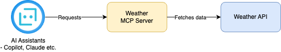
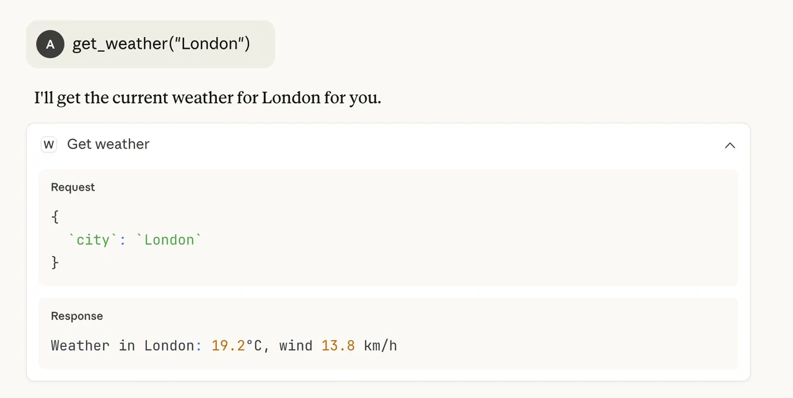

# WeatherMCP Server
- A Python-based MCP ([Model Code Provider](https://modelcontextprotocol.io/docs/getting-started/intro)) server that integrates with MCP Client (GitHub Copilot or Claude Desktop) as a tool for fetching weather data. 
- Built with Python, it runs as a local standard I/O server that can be configured in various MCP clients like VS Code’s mcp.json or .mcp.json for Claude Desktop.
- [Read more](https://modelcontextprotocol.io/docs/getting-started/intro)

# High level design



# Demo in action (with Claude Desktop)



# Sample prompts

````shell
get_weather {"city": "London"} # Retrieves current weather conditions.

get_forecast {"city": "London"} # Provides a short-term weather forecast.

get_alerts {"state": "CA"} # Fetches alerts for a specific region (e.g., US state).

Ask the WeatherMCP server for the weather in London.
````

# Setting Up the Weather MCP Server

## Clone the Repository

````shell
git clone https://github.com/Anshul619/weather-mcp-server
cd weather-mcp-server
````

## Create and activate a virtual environment

````shell
python3 -m venv .venv
source .venv/bin/activate
````

# Install Dependencies

````shell
pip install -r requirements.txt
````

# Run the Server

````shell
source .venv/bin/activate
python weather_server.py
````

# Configure for Claude Desktop (optional)
- Add following JSON to `claude_desktop_config.json` file.
- [Read more](https://modelcontextprotocol.io/docs/develop/build-server)

````json
{
  "mcpServers": {
		"WeatherMCP": {
			"type": "stdio",
			"command": "<path>/weather-mcp/.venv/bin/python3",
			"args": [
				"<path>/weather-mcp/weather_server.py"
			]
		}
	}
}
````


# Configure for Copilot (through visual code)
- If you're using VS Code with **GitHub Copilot**, add the following configuration to your `~/.vscode/mcp.json` file and restart VS code.
- [Read more](https://code.visualstudio.com/docs/copilot/customization/mcp-servers)

````json
{
  "servers": {
		"WeatherMCP": {
			"type": "stdio",
			"command": "<path>/weather-mcp/.venv/bin/python3",
			"args": [
				"<path>/weather-mcp/weather_server.py"
			]
		}
	}
}
````

## Verify Copilot sees your MCP server
- Open VS Code Command Palette (Cmd+Shift+P on Mac, Ctrl+Shift+P on Windows).
- Search for `Copilot: List MCP Servers` (this command was added when MCP support shipped).
- You should see WeatherMCP in the list.

If it’s missing:
- Check that your `~/.vscode/mcp.json` path is correct.
- Check the log: **View** → **Output** → **Copilot (dropdown)** for MCP errors.

## Debugging tips
- If Copilot doesn't show your server: check `~/.vscode/mcp.json` syntax (must be valid JSON).
- If the server crashes: run `python weather_server.py` manually in a terminal to see errors.
- You can also add debug `print()` calls in `handle_tool_call` to see incoming requests.